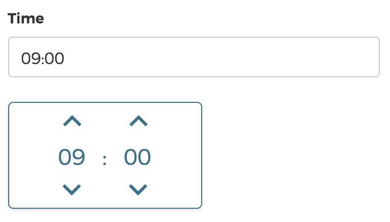

# COMPEON Timepicker

Simple time picker component built with react and styled-components.



## Installation

```bash
yarn add @compeon/timepicker
```

Install `styled-components`

```bash
yarn add styled-components
```

## Usage

```jsx
import CompeonTimepicker from '@compeon/timepicker'

class Timepicker extends React.Component {
  state = {
    value: '17:30'
  }

  handleChange = value => this.setState({ value })

  render () {
    return (
	    <CompeonTimepicker onChange={this.handleChange} value={this.state.value}>
	      <input />
 	    </CompeonTimepicker>
 	  )
  }
}
```

## Props

prop | description | type | default | example
------------ | ------------- | ------------- | ------------- | -------------
className | The class name to be applied to the outermost div of the time picker |string ||
dialogClassName | The class name to be applied to the dialog of the time picker | string ||
from | Lower time boundary for the time range to pick from. If this prop is set, `to` has to be set as well |string|| `"10:00"`
inputClassName | The class name to be applied to the child of the time picker |string||
minutesPerStep | The amount of minutes to add or subtract when the user changes the minutes via the arrow buttons or the mouse wheel | int | `15` |
onBlur | Function that is called when the time picker is closed | function ||
onChange | Function that is called when the value of the time picker changes | function ||
onFocus | Function that is called when the time picker is focussed | function ||
to | Upper time boundary for the time range to pick from. If this prop is set, `from` has to be set as well | string || `"17:30"`
value | The value to currently display. In case the initial value is outside of the specified time range, the time picker will immediately call `onChange` with a value that is in range | string | `"00:00"` | `"22:45"`

## Author

[Gerrit Seger](https://github.com/GerritSe) (gseger@compeon.de)

[COMPEON](https://compeon.de/)

## License

MIT
